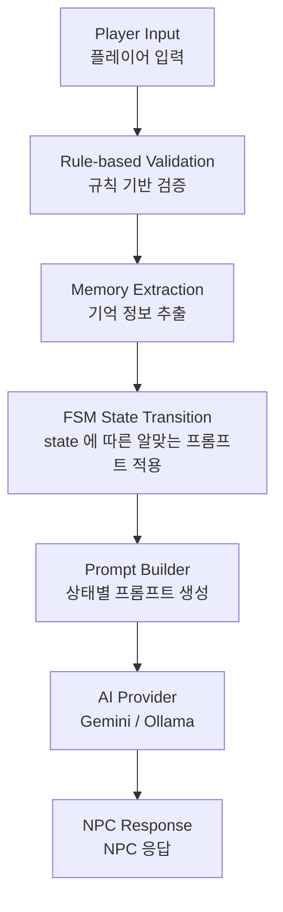

# HSK AI Chat

HSK1 학습자를 위한 AI 기반 중국어 회화 학습 앱입니다.

## 프로젝트 목적

초급 학습자는 실생활에서 배운것을 활용하기 어렵습니다. 
AI 가 실수하는 것처럼, 상대방이 너무 어려운 단어,문장을 사용하거나 배운적 없는 단어,주제가 쏟아지기 때문입니다.

본 프로젝트는 HSK1 수준에 맞춘 대화 흐름과 AI를 결합하여
AI를 제어하여 초급학습자를 위한 챗봇으로 활용할수 있습니다.

## 프로젝트 구조
- MVVM(Model-View-ViewModel) + Repository(데이터 접근) 적용
- Hive
  
## Tech Stack

- Flutter
- Dart
- Hive
- Gemini API
- Ollama
- JSON

## 특징
- HSK 레벨 선택
- NPC 기반 회화 학습
- FSM 기반 대화 시스템
   - 대화 흐름의 일관성 및 LLM의 주제 이탈 방지
- Prompt 기반 AI 제어
  - Persona, State, Memory Prompt를 분리하여 관리
  - 상황에 따라 필요한 Prompt를 조합하여 AI 동작 제어
- Rule-based 입력 검증
   - 사용자 입력을 규칙 기반으로 분석하여 첫 인사 등 공통 패턴은 AI 호출 없이 처리하고, 필요한 경우에만 LLM을 호출하도록 설계.
   - 의문문에서는 정보를 저장하지 않음.
- Gemini / Ollama 지원
  - AI Provider를 통해 Gemini와 Ollama를 동일한 인터페이스로 사용할 수 있도록 설계하여 개발 테스트시 드는 AI 비용 축소. 
- 단어장 시스템
  - HSK 레벨별 단어를 확인
  - 암기 여부를 관리
  - 검색 기능 구현

## AI 호출 및 답변 생성 구조

## 트러블 슈팅

### 1. Rule-based Validation 도입 이유 (Cheap Guardrail)
문제)
- 메모리 추출 단계에서 사용자의 질문(예: "내 이름이 뭐야?")도 기억으로 저장되어 메모리가 오염되는 문제가 있었습니다.
또한 단순히 의문문인지 확인하는 작업까지 LLM을 호출하는 것은 비용과 응답 속도 측면에서 비효율적이었습니다.

해결)
- AI 호출 전에 Rule-based Validation을 추가하여 의문문과 같은 단순 패턴을 먼저 판별하도록 설계했습니다.
이를 통해 Cheap Guardrail 역할을 수행하도록 했습니다

효과)
- AI 호출 횟수를 줄이고, 메모리 오염도 낮출수 있었습니다.

### 2.Prompt 분리

문제)

하나의 긴 Prompt에 모든 규칙을 작성하니
중요한 규칙이 잘 지켜지지 않았습니다.

해결)

Prompt를

- Persona
- State
- Memory 

로 분리하여
상황에 맞게 조합하도록 변경했습니다
중요한 규칙을 어길경우, [반드시] 등 강조하여 해당 규칙을 지키는지 확인했습니다.

효과)

- 상태별 규칙 관리가 쉬워짐
- 중요 규칙을 강조하기 쉬워짐
- Prompt 유지보수성 향상

## 업데이트 계획
- 음성 인식 추가 -> 실제 대화하는 느낌의 학습

- 
