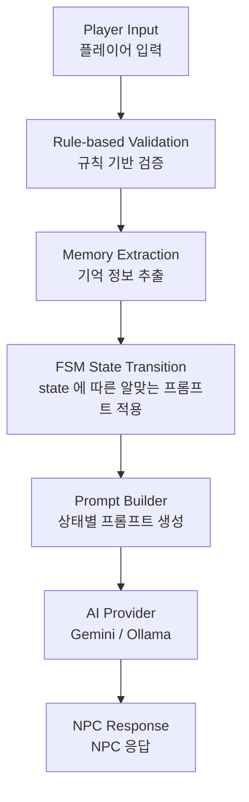

# HSK AI Chat

HSK 학습자를 위한 AI 기반 중국어 회화 학습 앱입니다.

## 프로젝트 목적

초급 학습자는 실생활에서 배운 표현을 실제 대화에서 활용하기 어렵습니다.

기존 LLM은 학습 수준을 고려하지 않고 다양한 주제와 표현을 생성하기 때문에,
초급 학습자가 지속적으로 대화를 이어가기 어려운 문제가 있습니다.

본 프로젝트는 NPC와의 대화를 통해 중국어를 학습할 수 있도록
Prompt Engineering, Conversation Memory, FSM(Finite State Machine)을 적용하여
LLM의 대화 흐름을 제어하는 것을 목표로 개발했습니다.

## 프로젝트 구조
- MVVM(Model-View-ViewModel) + Repository(데이터 접근) 적용
- Hive
  
## Tech Stack

- Flutter
- Dart
- Hive
- Gemini API
- Ollama
- JSON

## 특징

- NPC 기반 AI 회화
- FSM(Finite State Machine) 기반 대화 제어
- Prompt Engineering
  - Persona Prompt
  - State Prompt
  - Memory Prompt
- Conversation Memory
- Rule-based Validation (Cheap Guardrail)
- AI Provider 추상화 (Gemini / Ollama)
- HSK 단어장

## AI 호출 및 답변 생성 구조

## 트러블 슈팅

### 1. Rule-based Validation 도입 이유 (Cheap Guardrail)
문제)
- 메모리 추출 단계에서 사용자의 질문(예: "내 이름이 뭐야?")도 기억으로 저장되어 메모리가 오염되는 문제가 있었습니다.
또한 단순히 의문문인지 확인하는 작업까지 LLM을 호출하는 것은 비용과 응답 속도 측면에서 비효율적이었습니다.

해결)
- AI 호출 전에 Rule-based Validation을 추가하여 의문문과 같은 단순 패턴을 먼저 판별하도록 설계했습니다.
이를 통해 Cheap Guardrail 역할을 수행하도록 했습니다

효과)
- AI 호출 횟수를 줄이고, 메모리 오염도 낮출수 있었습니다.

### 2.Prompt 분리

문제)

하나의 긴 Prompt에 모든 규칙을 작성하니
중요한 규칙이 잘 지켜지지 않았습니다.

해결)

Prompt를

- Persona
- State
- Memory 

로 분리하여
상황에 맞게 조합하도록 변경했습니다
중요한 규칙을 어길경우, [반드시] 등 강조하여 해당 규칙을 지키는지 확인했습니다.

효과)

- 상태별 규칙 관리가 쉬워짐
- 중요 규칙을 강조하기 쉬워짐
- Prompt 유지보수성 향상

### 3. FSM 도입

문제

LLM이 대화 도중 의도하지 않은 주제로 벗어나거나
같은 질문을 반복하는 문제가 있었습니다.

해결

NPC의 대화를 State 기반으로 관리하고
상태별 목표가 달성되면 다음 State로 전이하도록 구현했습니다.

효과

- 대화 흐름 유지
- 주제 이탈 감소
- 학습 순서 제어

## 업데이트 계획

- 음성 인식(STT) 기반 회화
- Embedding 및 Retrieval(RAG)을 활용한 Conversation Memory 검색

- 
